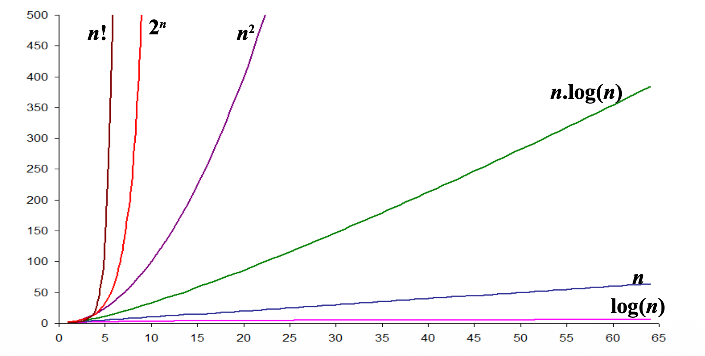
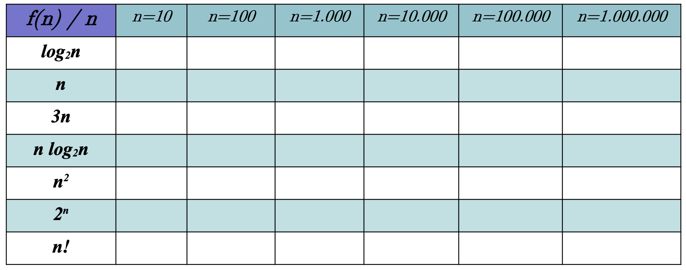
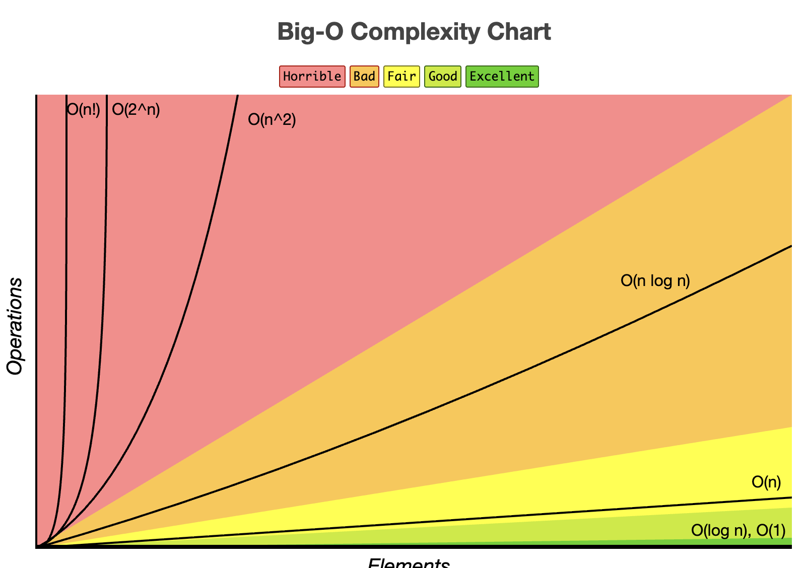
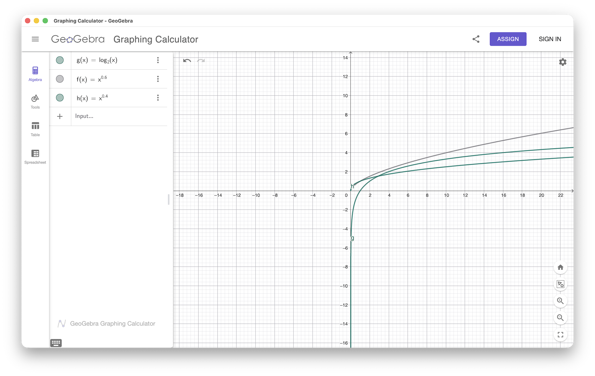

# 2026-1

[FreeForm](https://www.icloud.com/freeform/0ae1gW47bHvmS8Q-gt5aMlWqg#UDESC)  

Prof. André Tavares da Silva - Projeto e Análise de Algoritmos.  
Sala – I005  
Quartas  
13:30\~15:10 e 15:20\~17:00  
15:10\~15:20 intervalo.  
Início das aulas: 12/03/2026

PROCESSO SELETIVO ALUNO ESPECIAL 2026/1 - inscrições: 25 e 26/02/2026
<https://www.udesc.br/cct/secretariapos/aluno_especial>

----

<https://www.udesc.br/cct/secretariapos/processo_seletivo_editais>

----

Edital:
<https://www.udesc.br/arquivos/cct/id_cpmenu/11037/12___Edital_Processe_seletivo_Doutorado_v1_17642600991845_11037.pdf>

Linha de pesquisa: Metodologia e Técnicas de Computação (MTC)
Realidade Virtual

Anexo II: preencher e pegar as 2x assinaturas
Anexo III: preencher com as disciplinas do M.Sc. e DR. da UFRGS e 2x da UDESC

## Referência para Estudo

CORMEN, Thomas H. et al. Algoritmos: teoria e prática. 4. ed. Rio de Janeiro: LTC, 2024.  
Parte IV.  
<a href="zotero://select/library/items/LYQNTQG9">Algoritmos: teoria e prática</a>.  
<marginnote4app://note/B85D5600-6A87-44E4-866B-2D5FA8244507>.  

CORMEN, Thomas H. Desmistificando algoritmos. Rio de Janeiro: Elsevier, 2014.  
Capítulo 2.  
<a href="zotero://select/library/items/DYSI9IZH">Desmistificando algoritmos</a>.  
<marginnote4app://note/B9020E27-3109-4532-B0D8-2330B5261F60>.  

DASGUPTA, Sanjoy; PAPADIMITRIOU, Christos H; VAZIRANI, Umesh Virkumar. Algoritmos. São Paulo: McGraw-Hill, 2009.  
Capítulo 2.  
<a href="zotero://select/library/items/LQA3EWCB">Algoritmos</a>.  
<marginnote4app://note/947489D5-D71F-4D89-91DD-1451FAF4B0F6>.  

## Aula_01 - 2026-03-18 - 13:40

Material de aula: <https://moodle.joinville.udesc.br/course/view.php?id=10539>.  
SIGA <siga.udesc.br>.  

Melhor referência: CORMEN, Thomas H. Desmistificando algoritmos. Rio de Janeiro: Elsevier, 2014. Capítulo 2.  

### [Slides: PAA_01a.pdf](./_Topico1/_slides/PAA_01a.pdf)

Na realizada, estamos interessados em 2 medidas:  

- tempo de execução (complexidade de tempo)  
- quantidade de memória utilizada (complexidade de espaço)  

Para analisar um algoritmo é necessário definir um modelo de computação.  

Maioria dos algoritmos são ordem de $\log_2(x)$ (por usar árvores).  

#### Atividade 1

Elabore o melhor algoritmo para receber uma sequencia de `n` números inteiros. Depois o algoritmo deve receber um número `m` e deve trazer como saída o número de vezes que o valor `m` apareceu nesta sequência.

- Considere n < 1.000.000
- NOTA: existe alguma consideração diferente caso `m` seja um inteiro entre 0 e 10.000, ou um inteiro entre 0 e 1.000.000.000.000?
- OBS: e se o valor de `m` fosse informado antes da sequência de `n` números?

Crie um arquivo de entrada com valores aleatórios.  

### Complexidade

.  
.  
.  

### [Slides: PAA_01b.pdf](./_Topico1/Atividade01_IntroducaoExercicios/README.pdf)

## 2026-03-25 - 14:20

Em matemática se usa muito log base 10. Em computação se usa log base 2.  

Bubble Sort: mais "simples" (natural).  

## 2026-04-01 - 13:35

Jupyter \[IDE online].  
<https://jupyter.org/try-jupyter/lab/>.  

Kaggle \[IDE online].  
<https://www.kaggle.com>.  

Google Colab \[IDE online].  
<https://colab.research.google.com>.  

Visual Studio Code \[VSCode online].  
<https://vscode.dev/?vscode-lang=pt-br>.  

WinLibs standalone build of GCC and MinGW-w64 for Windows.  
<https://winlibs.com>.  

Complexidade de diferentes algoritmos.  
<https://www.bigocheatsheet.com>.  

.  

[Slides: PAA_03](_Topico2/_slides/PAA_03.pdf).  

`T(n) = O(log n)`.  

Matemática log2 n -> computação log n  

[Aula_2026-04-01](_Topico2/_slides/Aula_2026-04-01.pdf).  
Respostas da atividade do último slides.  
[Explicação](_Topico2/_slides/recorrencias_resolucao_completa.pdf).  

## 2026-04-08 - 18:01

[PAA_04.pdf](_Topico2/_slides/PAA_04.pdf).  

### Teorema Mestre

.  
<iframe src="https://www.geogebra.org/graphing/nhaechek?embed" width="800" height="600" allowfullscreen style="border: 1px solid #e4e4e4;border-radius: 4px;" frameborder="0"></iframe>

TODO: Fazer
[Python_Slides_PAA_04_Atividade1](_Topico2/Python_Slides_PAA_04_Atividade1.pdf).  
[Python_Slides_PAA_04_Atividade2](_Topico2/Python_Slides_PAA_04_Atividade2.pdf).  
[Python_Slides_PAA_04_Atividade3](_Topico2/Python_Slides_PAA_04_Atividade3.pdf).  
