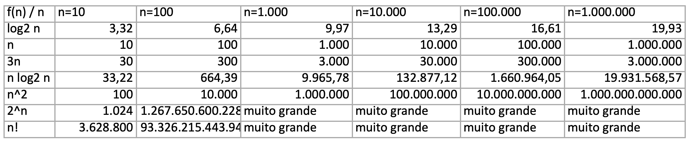

# Atividade 1

Disciplina: Projeto e Análise de Algoritmos.  
Professor: André Tavares da Silva.  
Aluno: Dalton Solano dos Reis.  

## Questão A

A) Elabore o melhor algoritmo para receber uma sequencia de n números inteiros. Depois o algoritmo deve receber um número m e deve trazer como saída o número de vezes que o valor m apareceu nesta sequência.
• Considere n < 1.000.000
• NOTA: existe alguma consideração diferente caso m seja um inteiro entre 0 e 10.000, ou um inteiro entre 0 e 1.000.000.000.000?
• OBS: e se o valor de m fosse informado antes da sequência de n números?  

*Prompt_Codex:*  
Elabore o melhor algoritmo para receber uma sequencia de `n` números inteiros. Depois o algoritmo deve receber um número `m` e deve trazer como saída o número de vezes que o valor `m` apareceu nesta sequência.

- Considere `n` < 1.000.000
- OBS: e se o valor de `m` fosse informado **antes** ou **depois** da sequência de `n` números?

### Considerações: antes e depois

A implementação desses códigos estão em:

- [linguagem C++](./CMaisMais/main.cpp)  
- [linguagem C#](./CSharp/Program.cs)  
- [linguagem Python](./Python/main.ipynb)

O melhor algoritmo depende principalmente de quando `m` é informado.  

Se `m` for informado **ANTES** da sequência, a melhor solução (algoritmo) é fazer uma única varredura e contar.

```text
leia n
leia m
contador <- 0

para i de 1 até n:
    leia x
    se x = m:
        contador <- contador + 1

escreva contador
```

Complexidade:

- Tempo: O(n)
- Memória: O(1)

Isso é ótimo, porque para saber quantas vezes `m` aparece, só precisa olhar os `n` valores pelo menos uma vez.

Se `m` for informado **DEPOIS** da sequência, não dá para contar diretamente durante a leitura, é preciso guardar a sequência inteira, e depois percorrê-la contando `m` (algoritmo).

```text
leia n
para i de 1 até n:
    leia a[i]

leia m
contador <- 0

para i de 1 até n:
    se a[i] = m:
        contador <- contador + 1

escreva contador
```

Complexidade:

- Tempo: O(n)
- Memória: O(n)

Resposta: existe uma diferença em relação a quantidade de memória alocada.  

----

### Considerações: valor maior que 10.000

*Prompt_Codex:*  
Existe alguma consideração diferente caso `m` seja um inteiro entre 0 e 10.000 (dez mil), ou um inteiro entre 0 e 1.000.000.000.000 (um trilhão)?

Sim. A principal diferença é o tipo de dado e a estrutura mais eficiente, mas isso afeta mais a método **DepoisSequencia** do que **AntesSequencia**.

#### AntesSequencia - dez mil

Se `m` vem antes da sequência, é só compara cada valor lido com `m`. Nesse caso:

- Se `m` estiver entre 0 e 10.000, `int` serve normalmente.  
- Se `m` puder chegar a 1.000.000.000.000, `int` *não* serve em C#.  

Se deve usar `long` para `m` e para cada `x` lido.

#### DepoisSequencia - dez mil

Se os valores estiverem em um intervalo pequeno, como 0..10.000, pode ser interessante usar um vetor de frequências em vez de guardar toda a sequência.  
Se os valores puderem ser muito grandes, como até 1.000.000.000.000, um vetor indexado não é viável, então você deve usar `long[]` para armazenar a sequência, ou então um `Dictionary<long, int>` se quiser contar frequências.  

##### Caso 0..10.000

Se pode fazer algo mais eficiente para múltiplas consultas:  
    `int[] freq = new int[10001];`  

##### Caso 0..1.000.000.000.000

Não dá para fazer:  
    `int[] freq = new int[1000000000001];`  
porque isso exigiria memória absurda. Nesse caso:  

- usar `long` para os valores  
- guardar a sequência em long[] ou use `Dictionary<long, int>`  

## Questão B

B) Considere que cada operação leva 1ns em média em um determinado processador. Determine o tempo das funções log2 n, n, 3n, n log2 n, n^2, 2^n e n! para as seguintes quantidades de operações: 10, 100, 1.000, 10.000, 100.000 e 1.000.000.  

  

## Anexo Códigos
