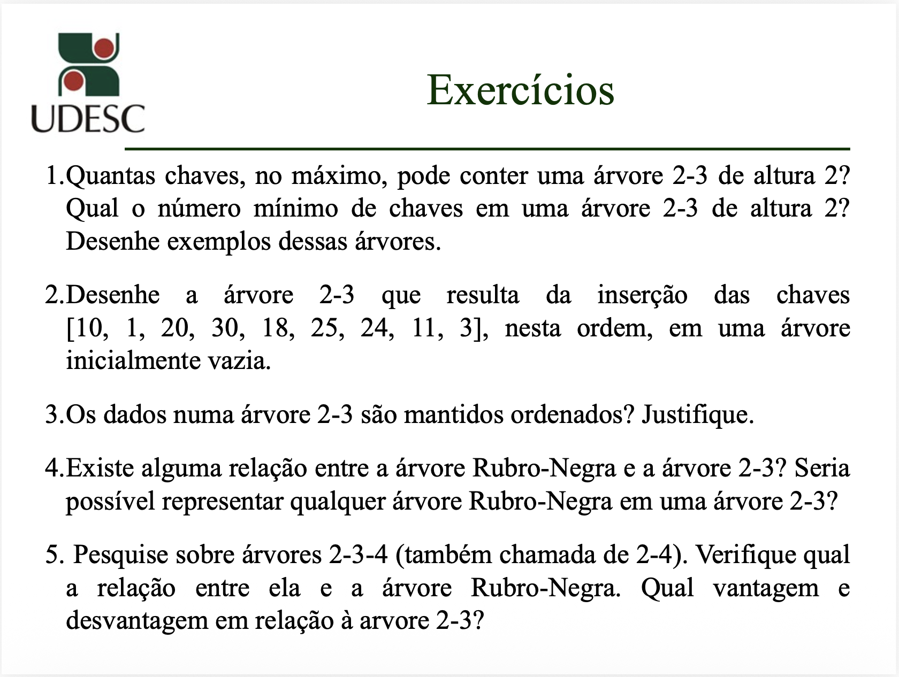
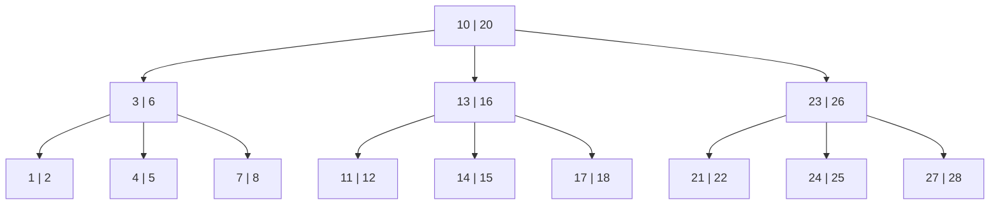
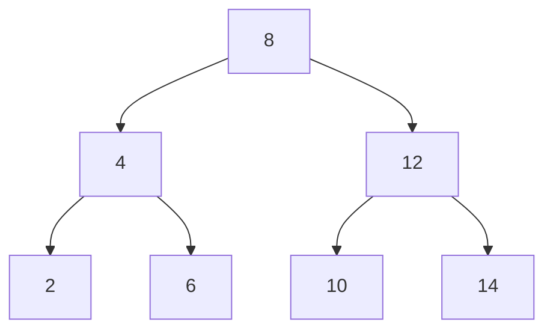
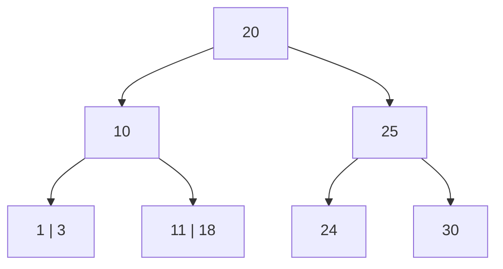
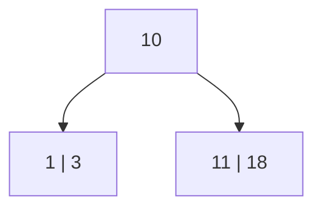
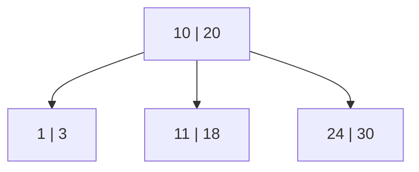
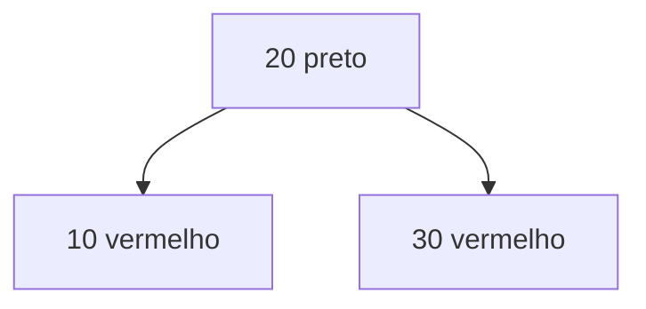

# Resolução — Árvores 2-3

## Enunciado da atividade

  

## Convenção usada

Neste exercício, considerei **altura 2** como a distância, em arestas, da raiz até uma folha. Assim, a árvore possui três níveis:

- nível 0: raiz;
- nível 1: filhos da raiz;
- nível 2: folhas.

Em uma **árvore 2-3**:

- cada nó interno pode ter **2 filhos e 1 chave**, ou **3 filhos e 2 chaves**;
- todas as folhas ficam no mesmo nível;
- as chaves são mantidas em ordem.

---

## 1. Quantidade máxima e mínima de chaves em uma árvore 2-3 de altura 2

### Máximo

Para ter o número máximo de chaves, todos os nós devem ser nós com **3 filhos e 2 chaves**.

Quantidade de nós por nível:

| Nível | Quantidade de nós |
|---|---:|
| 0 | 1 |
| 1 | 3 |
| 2 | 9 |

Total de nós:

```text
1 + 3 + 9 = 13 nós
```

Como cada nó tem 2 chaves:

```text
13 × 2 = 26 chaves
```

Portanto, o número máximo é:

```text
26 chaves
```

Exemplo de árvore máxima:



### Mínimo

Para ter o número mínimo de chaves, todos os nós devem ser nós com **2 filhos e 1 chave**.

Quantidade de nós por nível:

| Nível | Quantidade de nós |
|---|---:|
| 0 | 1 |
| 1 | 2 |
| 2 | 4 |

Total de nós:

```text
1 + 2 + 4 = 7 nós
```

Como cada nó tem 1 chave:

```text
7 × 1 = 7 chaves
```

Portanto, o número mínimo é:

```text
7 chaves
```

Exemplo de árvore mínima:



---

## 2. Inserção das chaves `[10, 1, 20, 30, 18, 25, 24, 11, 3]`

Inserindo as chaves nessa ordem em uma árvore 2-3 inicialmente vazia, o resultado final é:



Representação textual:

```text
              [20]
             /    \
          [10]    [25]
         /   \    /   \
    [1,3] [11,18] [24] [30]
```

A árvore está balanceada porque todas as folhas estão no mesmo nível.

---

## 3. Os dados em uma árvore 2-3 são mantidos ordenados?

Sim.

Em uma árvore 2-3, as chaves são mantidas ordenadas dentro dos nós e também respeitam a ordem entre as subárvores.

### Nó com 1 chave

Em um nó com uma chave `K`:

```text
valores da subárvore esquerda < K < valores da subárvore direita
```

Exemplo:



Nesse caso:

```text
1, 3 < 10 < 11, 18
```

### Nó com 2 chaves

Em um nó com duas chaves `K1` e `K2`:

```text
valores da esquerda < K1 < valores do meio < K2 < valores da direita
```

Exemplo:



Portanto, uma árvore 2-3 mantém os dados ordenados e permite percorrê-los em ordem crescente usando percurso em ordem.

---

## 4. Relação entre árvore Rubro-Negra e árvore 2-3

Existe relação entre elas.

Uma árvore Rubro-Negra pode ser vista como uma forma binária de representar árvores balanceadas multiway, como árvores 2-3 e 2-3-4.

Na equivalência mais comum:

- um nó preto sozinho representa um nó 2;
- um nó preto ligado a um nó vermelho representa um nó 3;
- um nó preto ligado a dois nós vermelhos representa um nó 4.

Assim, uma árvore Rubro-Negra está mais diretamente relacionada à **árvore 2-3-4**.

### É possível representar qualquer árvore Rubro-Negra em uma árvore 2-3?

Não necessariamente.

Uma árvore Rubro-Negra comum pode possuir uma configuração equivalente a um nó 4, isto é, um nó preto com dois filhos vermelhos. Esse caso corresponde a uma árvore 2-3-4, mas não a uma árvore 2-3.

Portanto:

```text
Toda árvore 2-3 pode ser representada como uma árvore Rubro-Negra.
Nem toda árvore Rubro-Negra comum representa diretamente uma árvore 2-3.
```

Para representar especificamente árvores 2-3, costuma-se usar uma variação mais restrita, como a **árvore Rubro-Negra inclinada à esquerda** (*Left-Leaning Red-Black Tree*), evitando configurações que representem nós 4.

---

## 5. Árvores 2-3-4 e relação com árvore Rubro-Negra

Uma **árvore 2-3-4**, também chamada de **árvore 2-4**, é uma generalização da árvore 2-3.

Nela, cada nó pode ser:

| Tipo de nó | Quantidade de chaves | Quantidade de filhos |
|---|---:|---:|
| Nó 2 | 1 chave | 2 filhos |
| Nó 3 | 2 chaves | 3 filhos |
| Nó 4 | 3 chaves | 4 filhos |

Assim como na árvore 2-3, todas as folhas ficam no mesmo nível.

### Relação com árvore Rubro-Negra

A árvore Rubro-Negra é uma representação binária de uma árvore 2-3-4.

A equivalência pode ser vista assim:

| Árvore 2-3-4 | Representação em Rubro-Negra |
|---|---|
| Nó 2 | nó preto |
| Nó 3 | nó preto com um filho vermelho |
| Nó 4 | nó preto com dois filhos vermelhos |

Exemplo conceitual de um nó 4:

```text
Árvore 2-3-4:

        [10 | 20 | 30]

Representação Rubro-Negra equivalente:

            20 preto
           /        \
      10 vermelho   30 vermelho
```

Em Mermaid:



### Vantagem da árvore 2-3-4 em relação à árvore 2-3

A principal vantagem é que a árvore 2-3-4 é mais flexível, pois permite nós com até 3 chaves e 4 filhos.

Isso pode reduzir a necessidade de divisões frequentes durante inserções.

Em uma árvore 2-3, um nó cheio possui 2 chaves. Ao tentar inserir uma terceira chave, o nó precisa ser dividido.

Em uma árvore 2-3-4, um nó pode armazenar até 3 chaves antes de precisar ser dividido.

Portanto, a árvore 2-3-4 pode exigir menos reestruturações em algumas inserções.

### Desvantagem da árvore 2-3-4 em relação à árvore 2-3

A principal desvantagem é a maior complexidade de implementação.

Como os nós podem ter 1, 2 ou 3 chaves e 2, 3 ou 4 filhos, o código precisa tratar mais casos.

Na árvore 2-3, há menos possibilidades:

- nó com 1 chave e 2 filhos;
- nó com 2 chaves e 3 filhos.

Na árvore 2-3-4, há uma possibilidade adicional:

- nó com 3 chaves e 4 filhos.

Assim, a árvore 2-3-4 é mais flexível, mas também mais complexa.

---

## Resumo final

| Questão | Resposta |
|---|---|
| 1 | Máximo: 26 chaves. Mínimo: 7 chaves. |
| 2 | A raiz final é `[20]`, com filhos `[10]` e `[25]`. |
| 3 | Sim, as chaves são mantidas ordenadas. |
| 4 | Há relação com árvores Rubro-Negra, mas nem toda Rubro-Negra representa diretamente uma árvore 2-3. |
| 5 | A árvore 2-3-4 é mais flexível, mas mais complexa que a árvore 2-3. |
