# Resolução — Árvores B

## Convenção usada

Para esta resolução, considerei:

- **M = número máximo de filhos por nó**.
- Um nó pode ter, no máximo, **M - 1 chaves**.
- Para **grau mínimo 2, M = 4**: máximo de 3 chaves por nó.
- Para **grau 3, M = 6**: máximo de 5 chaves por nó.
- No `split` de um nó com 6 chaves, foi promovida a **3ª chave**, deixando:
  - 2 chaves no nó da esquerda;
  - 3 chaves no nó da direita.

---

# 1. Todas as árvores B válidas com grau mínimo 2 (M = 4) contendo as chaves 1, 2, 3, 4 e 5

Como `M = 4`, cada nó pode ter no máximo 3 chaves. Como existem 5 chaves, não é possível colocar todas em um único nó. Portanto, as árvores válidas terão altura 1.

## Árvore 1

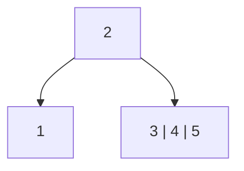

## Árvore 2

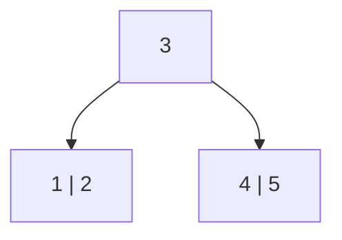

## Árvore 3

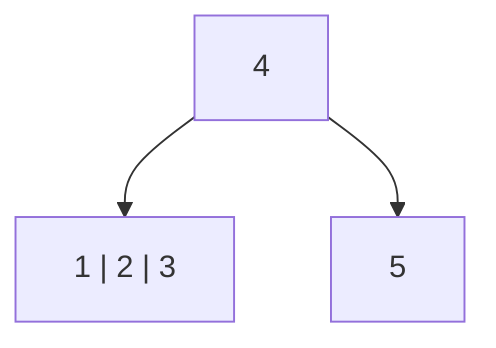

## Árvore 4

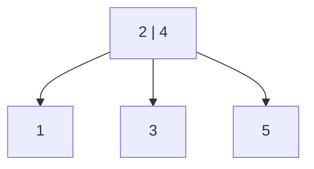

Essas são todas as possibilidades válidas, pois qualquer outra escolha de chaves na raiz deixaria algum filho vazio ou com número inválido de chaves.

---

# 2. Inserção das chaves em uma árvore B de grau 3 (M = 6)

Sequência de inserção:

```text
16, 29, 27, 21, 13, 22, 18, 30, 32, 33, 23, 28, 24, 26, 11, 12, 34, 35, 14, 36, 15
```

## Após inserir 16

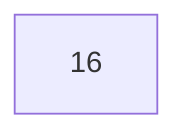

## Após inserir 29

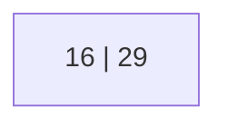

## Após inserir 27

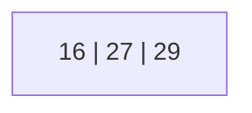

## Após inserir 21

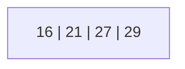

## Após inserir 13

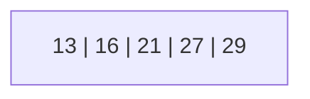

## Inserção de 22 — imediatamente antes do split

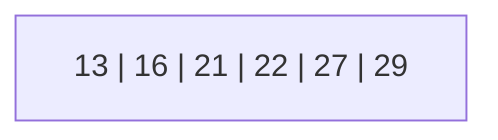

## Após inserir 22

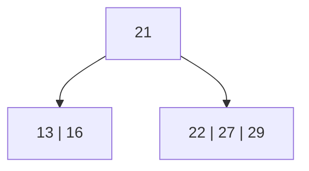

## Após inserir 18

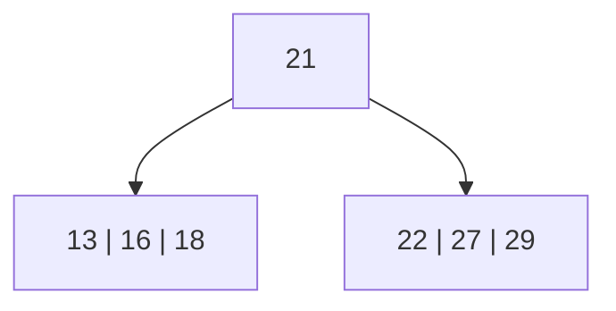

## Após inserir 30

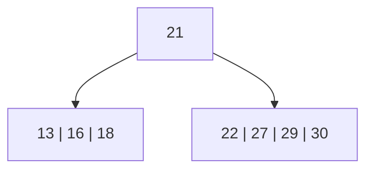

## Após inserir 32

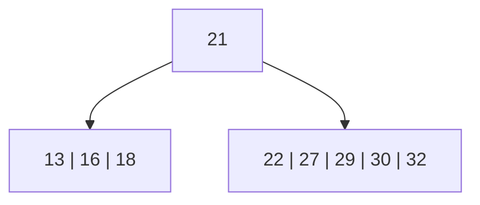

## Inserção de 33 — imediatamente antes do split

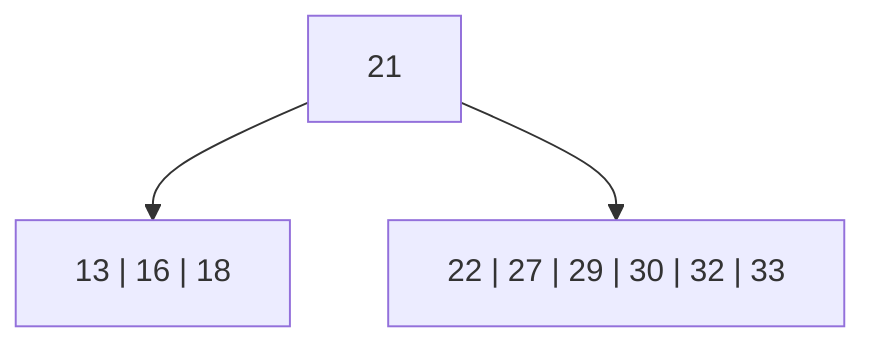

## Após inserir 33

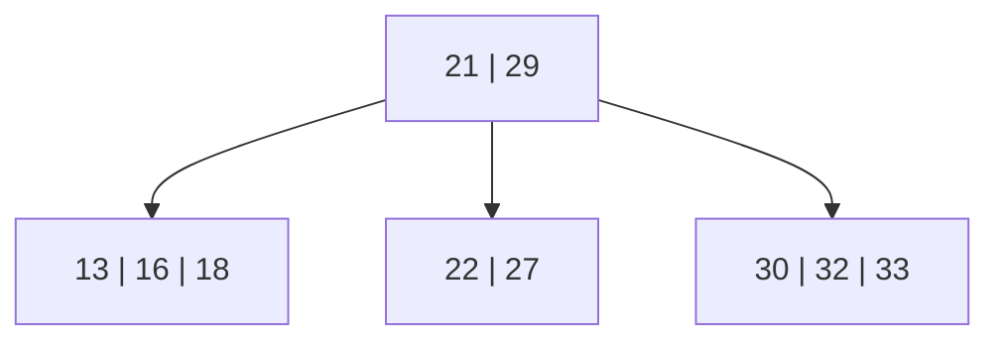

## Após inserir 23

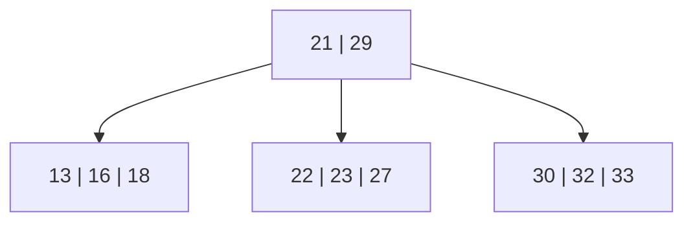

## Após inserir 28

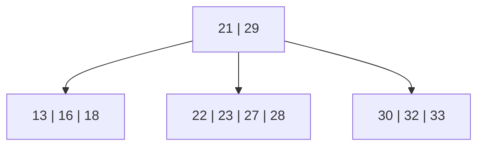

## Após inserir 24

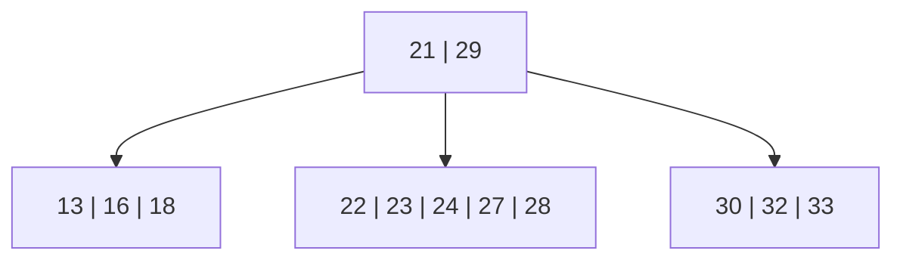

## Inserção de 26 — imediatamente antes do split

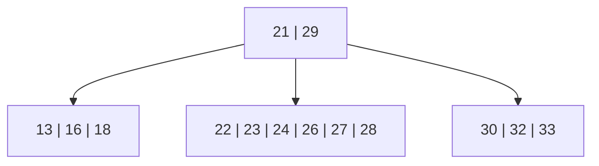

## Após inserir 26

```mermaid
flowchart TD
  N4["21 | 24 | 29"]
  N2["13 | 16 | 18"]
  N7["22 | 23"]
  N8["26 | 27 | 28"]
  N6["30 | 32 | 33"]
  N4 --> N2
  N4 --> N7
  N4 --> N8
  N4 --> N6
```

## Após inserir 11

```mermaid
flowchart TD
  N4["21 | 24 | 29"]
  N2["11 | 13 | 16 | 18"]
  N7["22 | 23"]
  N8["26 | 27 | 28"]
  N6["30 | 32 | 33"]
  N4 --> N2
  N4 --> N7
  N4 --> N8
  N4 --> N6
```

## Após inserir 12

```mermaid
flowchart TD
  N4["21 | 24 | 29"]
  N2["11 | 12 | 13 | 16 | 18"]
  N7["22 | 23"]
  N8["26 | 27 | 28"]
  N6["30 | 32 | 33"]
  N4 --> N2
  N4 --> N7
  N4 --> N8
  N4 --> N6
```

## Após inserir 34

```mermaid
flowchart TD
  N4["21 | 24 | 29"]
  N2["11 | 12 | 13 | 16 | 18"]
  N7["22 | 23"]
  N8["26 | 27 | 28"]
  N6["30 | 32 | 33 | 34"]
  N4 --> N2
  N4 --> N7
  N4 --> N8
  N4 --> N6
```

## Após inserir 35

```mermaid
flowchart TD
  N4["21 | 24 | 29"]
  N2["11 | 12 | 13 | 16 | 18"]
  N7["22 | 23"]
  N8["26 | 27 | 28"]
  N6["30 | 32 | 33 | 34 | 35"]
  N4 --> N2
  N4 --> N7
  N4 --> N8
  N4 --> N6
```

## Inserção de 14 — imediatamente antes do split

```mermaid
flowchart TD
  N4["21 | 24 | 29"]
  N2["11 | 12 | 13 | 14 | 16 | 18"]
  N4 --> N2
  N7["22 | 23"]
  N4 --> N7
  N8["26 | 27 | 28"]
  N4 --> N8
  N6["30 | 32 | 33 | 34 | 35"]
  N4 --> N6
```

## Após inserir 14

```mermaid
flowchart TD
  N4["13 | 21 | 24 | 29"]
  N9["11 | 12"]
  N10["14 | 16 | 18"]
  N7["22 | 23"]
  N8["26 | 27 | 28"]
  N6["30 | 32 | 33 | 34 | 35"]
  N4 --> N9
  N4 --> N10
  N4 --> N7
  N4 --> N8
  N4 --> N6
```

## Inserção de 36 — imediatamente antes do split

```mermaid
flowchart TD
  N4["13 | 21 | 24 | 29"]
  N9["11 | 12"]
  N4 --> N9
  N10["14 | 16 | 18"]
  N4 --> N10
  N7["22 | 23"]
  N4 --> N7
  N8["26 | 27 | 28"]
  N4 --> N8
  N6["30 | 32 | 33 | 34 | 35 | 36"]
  N4 --> N6
```

## Após inserir 36

```mermaid
flowchart TD
  N4["13 | 21 | 24 | 29 | 33"]
  N9["11 | 12"]
  N10["14 | 16 | 18"]
  N7["22 | 23"]
  N8["26 | 27 | 28"]
  N11["30 | 32"]
  N12["34 | 35 | 36"]
  N4 --> N9
  N4 --> N10
  N4 --> N7
  N4 --> N8
  N4 --> N11
  N4 --> N12
```

## Após inserir 15

```mermaid
flowchart TD
  N4["13 | 21 | 24 | 29 | 33"]
  N9["11 | 12"]
  N10["14 | 15 | 16 | 18"]
  N7["22 | 23"]
  N8["26 | 27 | 28"]
  N11["30 | 32"]
  N12["34 | 35 | 36"]
  N4 --> N9
  N4 --> N10
  N4 --> N7
  N4 --> N8
  N4 --> N11
  N4 --> N12
```

## Árvore final

```mermaid
flowchart TD
  N4["13 | 21 | 24 | 29 | 33"]
  N9["11 | 12"]
  N10["14 | 15 | 16 | 18"]
  N7["22 | 23"]
  N8["26 | 27 | 28"]
  N11["30 | 32"]
  N12["34 | 35 | 36"]
  N4 --> N9
  N4 --> N10
  N4 --> N7
  N4 --> N8
  N4 --> N11
  N4 --> N12
```

---

# 3. Leituras e escritas no pior caso

A árvore final tem altura 1, isto é, possui:

- raiz;
- folhas.

## Pior caso de busca

No pior caso, a busca precisa ler:

1. a raiz;
2. uma folha.

Portanto, o pior caso de busca faz:

```text
2 leituras
```

Esse pior caso ocorre quando o elemento procurado não está na raiz e é necessário descer até uma folha.

## Pior caso de inserção

No pior caso, a inserção precisa:

1. ler a raiz;
2. ler a folha onde a chave deveria ser inserida;
3. inserir a chave em uma folha cheia;
4. fazer split da folha;
5. atualizar a raiz;
6. se a raiz também ficar cheia demais, fazer split da raiz.

Como a árvore final tem raiz com 5 chaves, a raiz já está cheia. Assim, uma nova inserção que provoque split em uma folha pode também provocar split da raiz.

### Leituras

```text
2 leituras
```

### Escritas

Considerando que cada split grava os dois nós resultantes e também o nó pai atualizado:

- split da folha: 3 escritas;
- split da raiz: 3 escritas.

Logo, no pior caso:

```text
6 escritas
```

## Resumo

| Operação | Pior caso |
|---|---:|
| Busca | 2 leituras |
| Inserção | 2 leituras e 6 escritas |
